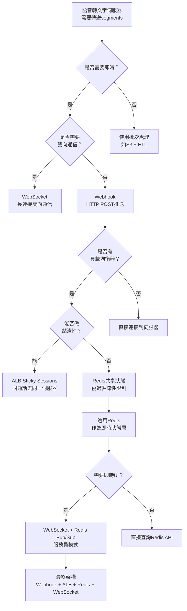
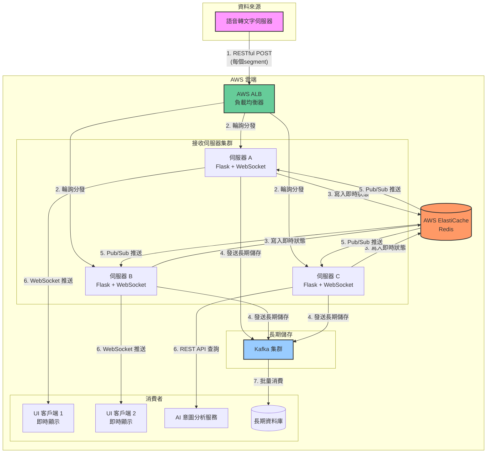
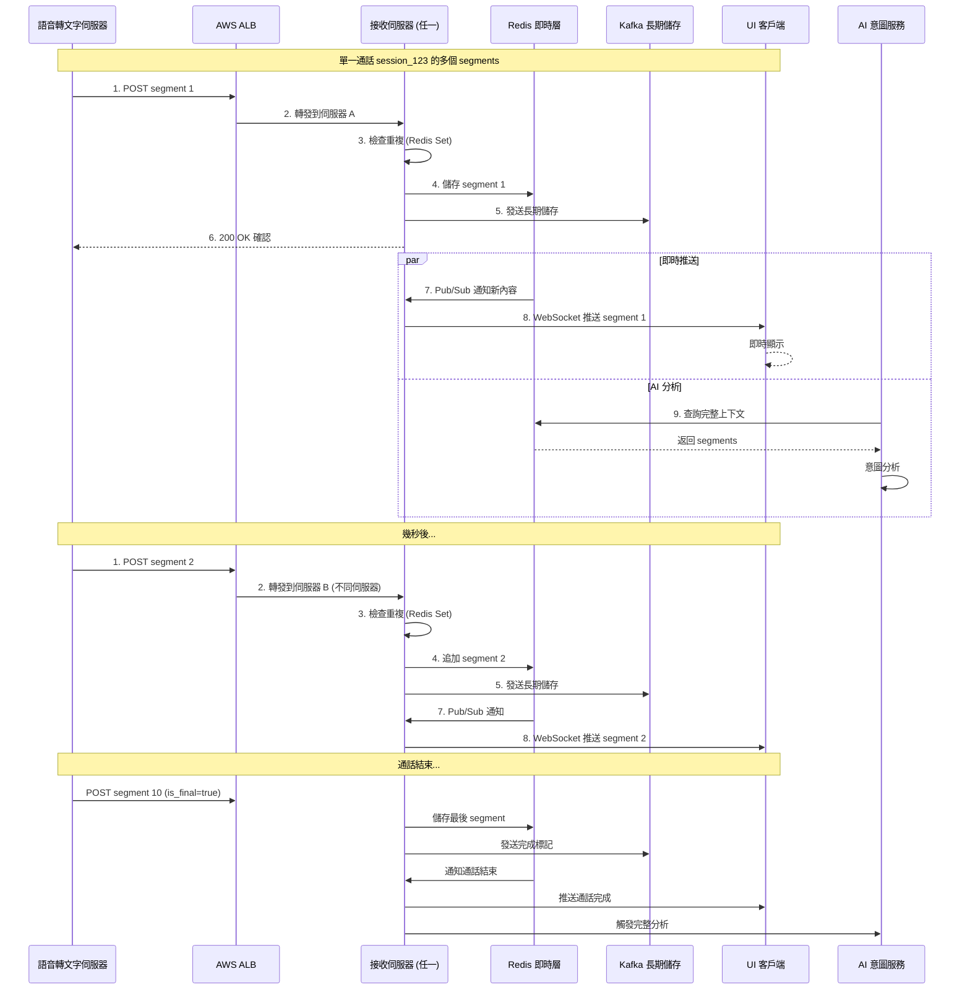
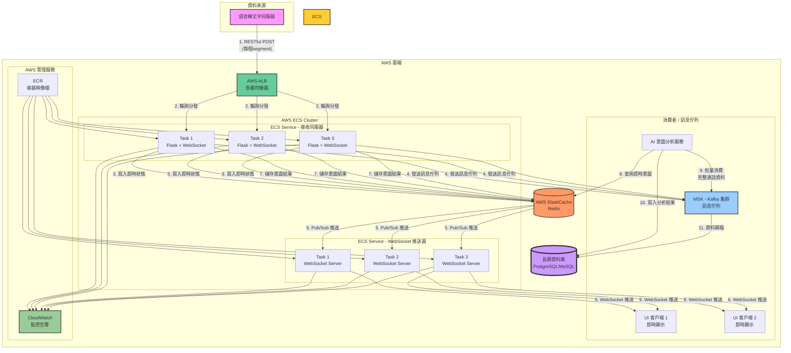
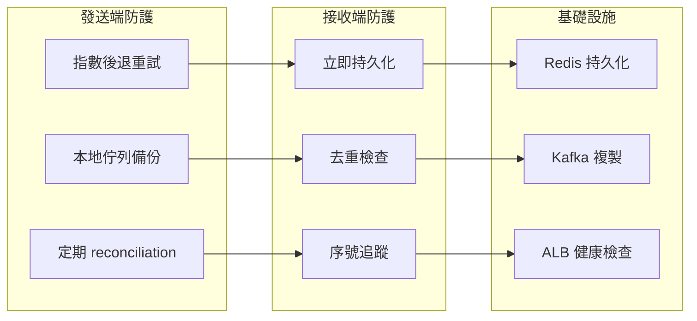
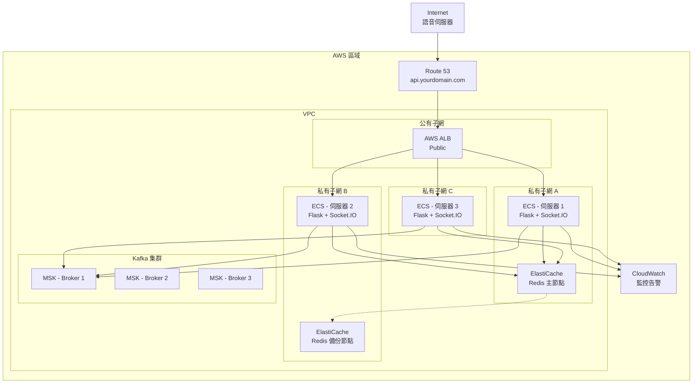
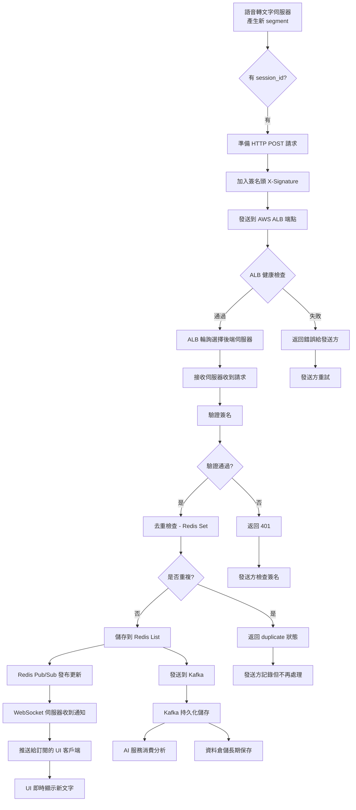

# RESTful API 語音轉文字即時處理系統架構完整指南

## 📋 目錄
1. [專案概述](#專案概述)
2. [核心架構決策](#核心架構決策)
3. [詳細架構設計](#詳細架構設計)
4. [元件說明](#元件說明)
5. [資料流程](#資料流程)
6. [關鍵實作](#關鍵實作)
7. [可靠性和錯誤處理](#可靠性和錯誤處理)
8. [部署架構](#部署架構)
9. [常見問題解決方案](#常見問題解決方案)

---

## 專案概述

本系統設計用於處理語音轉文字伺服器的即時串流，將轉寫後的文字可靠地傳送到多個下游服務，包括：

- 即時顯示 Transcript 的 UI 介面
- AI 意圖分析服務
- 長期資料儲存 (Kafka)

### 核心需求

- ✅ 即時性：文字出現後盡快送達各服務
- ✅ 可靠性：不流失任何 segment，可處理重複資料
- ✅ 可擴展性：支援多台伺服器橫向擴展
- ✅ 順序性：同一通話的 segments 必須保持順序

---

## 核心架構決策

### 主要元件選擇

| 元件 | 選擇 | 原因 |
|------|------|------|
| API 風格 | RESTful API (Webhook) | 簡單、標準、語音伺服器主動推送 |
| 負載均衡 | AWS ALB | 管理多台接收伺服器 |
| 即時狀態儲存 | Redis | 低延遲、支援 Pub/Sub、共享狀態 |
| 長期儲存 | Kafka | 持久化、可回溯、大數據分析 |
| 即時推送 | WebSocket + Redis Pub/Sub | 真正即時、節省資源 |
| 去重機制 | Redis Set | 簡單有效、效能好 |

### 架構決策樹



---

## 詳細架構設計

### 整體架構圖



### 資料流程順序圖



---

## 元件說明

### 1. 語音轉文字伺服器 (發送方)

```python
# 語音伺服器發送 segment 的邏輯
def send_segment(segment_data):
    response = requests.post(
        "https://your-alb.aws.com/api/transcript",
        json={
            "session_id": "call_123",
            "segment_id": 1,
            "text": "你好，我想查詢戶口結餘",
            "timestamp": "2024-01-15T10:30:05Z",
            "is_final": False
        },
        headers={"Authorization": "Bearer your-api-key"},
        timeout=5
    )
    
    if response.status_code == 200:
        # 成功，可從 response 知道是否重複
        result = response.json()
        if result.get('status') == 'duplicate':
            print("這個 segment 之前已送過")
    else:
        # 失敗，加入重試佇列
        retry_queue.add(segment_data)
```

### 2. AWS ALB 配置

```yaml
# AWS ALB Listener 規則
Listener: 443 HTTPS
  Rules:
    - Priority: 1
      Conditions:
        - PathPattern: /api/*
      Actions:
        - Type: forward
          TargetGroup: transcript-receivers
          
# Target Group 設定
TargetGroup: transcript-receivers
  Protocol: HTTP
  Port: 8080
  HealthCheck:
    Path: /api/health
    Interval: 30秒
  Attributes:
    Stickiness: false  # 不使用黏滯性，依賴 Redis
```

### 3. 接收伺服器核心程式碼

```python
# app.py - 完整的接收伺服器
from flask import Flask, request, jsonify
from flask_socketio import SocketIO, emit, join_room
import redis
import json
import hmac
import hashlib
from kafka import KafkaProducer
import threading
import time

app = Flask(__name__)
socketio = SocketIO(app, cors_allowed_origins="*")

# Redis 連接 (共享狀態)
redis_client = redis.Redis(
    host='myredis.cluster.aws.com',
    port=6379,
    decode_responses=True,
    socket_keepalive=True
)

# Redis Pub/Sub 客戶端 (用於監聽)
redis_pubsub = redis_client.pubsub()

# Kafka 生產者
kafka_producer = KafkaProducer(
    bootstrap_servers='kafka.aws.com:9092',
    value_serializer=lambda v: json.dumps(v).encode('utf-8'),
    key_serializer=lambda k: k.encode('utf-8')
)

# API 密鑰
API_SECRET = "your-secret-key"


def verify_signature(data, signature):
    """驗證請求是否來自合法語音伺服器"""
    expected = hmac.new(
        API_SECRET.encode(),
        data.encode(),
        hashlib.sha256
    ).hexdigest()
    return hmac.compare_digest(expected, signature)


@app.route('/api/transcript', methods=['POST'])
def receive_transcript():
    """接收語音轉文字伺服器推送的 RESTful API 端點"""
    
    # 1. 驗證請求
    signature = request.headers.get('X-Signature')
    if not signature or not verify_signature(request.data.decode(), signature):
        return jsonify({'error': 'Invalid signature'}), 401
    
    data = request.json
    session_id = data['session_id']
    segment_id = data['segment_id']
    
    # 2. 去重檢查 (使用 Redis Set)
    dedup_key = f"dedup:{session_id}"
    added = redis_client.sadd(dedup_key, segment_id)
    
    if added == 0:
        # 重複 segment
        return jsonify({
            'status': 'duplicate',
            'message': 'Segment already received'
        }), 200
    
    # 3. 儲存到 Redis List (保持順序)
    transcript_key = f"transcript:{session_id}"
    redis_client.rpush(transcript_key, json.dumps({
        'segment_id': segment_id,
        'text': data['text'],
        'timestamp': data.get('timestamp'),
        'is_final': data.get('is_final', False)
    }))
    
    # 4. 設定過期時間
    redis_client.expire(dedup_key, 7200)
    redis_client.expire(transcript_key, 7200)
    
    # 5. 發送到 Kafka (長期儲存)
    kafka_producer.send(
        topic='transcript_segments',
        key=session_id,
        value=data
    )
    
    # 6. 透過 Redis Pub/Sub 通知所有 WebSocket 伺服器
    redis_client.publish(
        f"transcript:{session_id}",
        json.dumps({
            'type': 'new_segment',
            'data': data,
            'timestamp': time.time()
        })
    )
    
    # 7. 如果是通話結束，觸發後續處理
    if data.get('is_final'):
        redis_client.publish(
            f"transcript:{session_id}",
            json.dumps({'type': 'call_ended', 'session_id': session_id})
        )
    
    return jsonify({
        'status': 'success',
        'received': True,
        'segment_id': segment_id
    }), 200


@app.route('/api/health', methods=['GET'])
def health_check():
    """健康檢查"""
    return jsonify({'status': 'healthy', 'server': request.host})


# ========== WebSocket 處理 ==========

@socketio.on('join_session')
def handle_join_session(data):
    """UI 客戶端加入某通通話的即時更新"""
    session_id = data['session_id']
    
    # 將客戶端加入房間
    join_room(f"session:{session_id}")
    
    # 發送最近的歷史記錄
    transcript_key = f"transcript:{session_id}"
    recent = redis_client.lrange(transcript_key, -10, -1)  # 最近10筆
    segments = [json.loads(s) for s in recent]
    
    emit('initial_history', {'segments': segments})
    
    print(f"Client joined session {session_id}")


def redis_listener():
    """背景執行緒：監聽 Redis Pub/Sub 並轉發給 WebSocket 客戶端"""
    pubsub = redis_client.pubsub()
    pubsub.psubscribe('transcript:*')  # 訂閱所有 transcript 頻道
    
    for message in pubsub.listen():
        if message['type'] == 'pmessage':
            # 解析 channel 名稱 (格式: transcript:session_id)
            channel = message['channel']
            session_id = channel.split(':')[1]
            
            # 透過 WebSocket 推送到對應房間
            socketio.emit(
                'transcript_update',
                json.loads(message['data']),
                room=f"session:{session_id}"
            )


# 啟動背景監聽執行緒
threading.Thread(target=redis_listener, daemon=True).start()


if __name__ == '__main__':
    socketio.run(app, host='0.0.0.0', port=8080, debug=False)
```

### 4. Redis 資料結構設計

```mermaid
graph LR
    subgraph Redis Keys
        A[dedup:call_123<br/>Set類型]
        B[transcript:call_123<br/>List類型]
        C[transcript:call_123:meta<br/>Hash類型]
        D[intent:call_123<br/>String類型]
    end
    
    A --> A1[segment_id: 1]
    A --> A2[segment_id: 2]
    A --> A3[segment_id: 3]
    
    B --> B1["[0] {segment 1 data}"]
    B --> B2["[1] {segment 2 data}"]
    B --> B3["[2] {segment 3 data}"]
    
    C --> C1[start_time: 10:30:05]
    C --> C2[status: in_progress]
    C --> C3[channel: 客服部]
    
    D --> D1[{intent: check_balance, confidence: 0.95}]
```

| Key 格式 | 類型 | 用途 | 過期時間 |
|----------|------|------|----------|
| `dedup:{session_id}` | Set | 儲存已收到的 segment_id，用於去重 | 2小時 |
| `transcript:{session_id}` | List | 按順序儲存所有 segments 內容 | 2小時 |
| `transcript:{session_id}:meta` | Hash | 儲存通話中繼資料 | 2小時 |
| `intent:{session_id}` | String | 快取 AI 意圖分析結果 | 1小時 |

### 5. Kafka 主題設計

| 主題名稱 | Partition 數 | 訊息 Key | 用途 |
|----------|--------------|----------|------|
| `transcript_segments` | 3 | `session_id` | 儲存所有原始 segments |
| `complete_calls` | 3 | `session_id` | 儲存完整通話文字 |
| `intent_analysis` | 2 | `session_id` | 儲存意圖分析結果 |
| `dead_letter_queue` | 1 | N/A | 儲存處理失敗的訊息 |

---

## 即時 UI 顯示架構

### WebSocket + Redis Pub/Sub 模式



### 前端 UI 程式碼

```javascript
// React/Vue 元件範例
class TranscriptDisplay extends React.Component {
    constructor(props) {
        super(props);
        this.state = {
            segments: [],
            socket: null,
            connected: false
        };
    }
    
    componentDidMount() {
        // 建立 WebSocket 連線
        const socket = io('https://your-server.com', {
            transports: ['websocket'],
            reconnection: true,
            reconnectionDelay: 1000,
            reconnectionDelayMax: 5000
        });
        
        socket.on('connect', () => {
            console.log('Connected to server');
            this.setState({ connected: true });
            
            // 加入指定的 session
            socket.emit('join_session', {
                session_id: this.props.sessionId
            });
        });
        
        socket.on('initial_history', (data) => {
            // 顯示歷史記錄
            this.setState({ segments: data.segments });
        });
        
        socket.on('transcript_update', (data) => {
            if (data.type === 'new_segment') {
                // 新 segment 到達
                this.addSegment(data.data);
            } else if (data.type === 'call_ended') {
                // 通話結束
                this.showCallSummary();
            }
        });
        
        socket.on('disconnect', () => {
            console.log('Disconnected from server');
            this.setState({ connected: false });
        });
        
        this.setState({ socket });
    }
    
    addSegment(segment) {
        this.setState(prev => ({
            segments: [...prev.segments, segment]
        }), () => {
            // 自動滾動到底部
            this.scrollToBottom();
        });
    }
    
    scrollToBottom() {
        const container = document.getElementById('transcript-container');
        container.scrollTop = container.scrollHeight;
    }
    
    render() {
        return (
            <div className="transcript-display">
                <div className="connection-status">
                    {this.state.connected ? '🟢 即時連線中' : '🔴 連線中斷'}
                </div>
                
                <div id="transcript-container" className="transcript-container">
                    {this.state.segments.map((seg, idx) => (
                        <div key={idx} className={`segment ${seg.is_final ? 'final' : ''}`}>
                            <span className="time">
                                {new Date(seg.timestamp).toLocaleTimeString()}
                            </span>
                            <span className="text">{seg.text}</span>
                            {seg.is_final && <span className="badge">✓</span>}
                        </div>
                    ))}
                </div>
            </div>
        );
    }
}

// 使用元件
<TranscriptDisplay sessionId="call_123" />
```

---

## 可靠性和錯誤處理

### 多層次防流失機制



### 去重實作（完整版）

```python
class DeduplicationManager:
    """去重管理器 - 防止同一 segment 重複處理"""
    
    def __init__(self, redis_client):
        self.redis = redis_client
    
    def is_duplicate(self, session_id, segment_id, segment_hash=None):
        """檢查是否重複"""
        dedup_key = f"dedup:{session_id}"
        
        # 簡單檢查：是否收過這個 segment_id
        if self.redis.sismember(dedup_key, segment_id):
            # 進階檢查：如果提供 hash，可以比對內容是否一致
            if segment_hash:
                stored_hash = self.redis.hget(f"hash:{session_id}", segment_id)
                if stored_hash == segment_hash:
                    return True, 'exact_duplicate'
                else:
                    # 相同 ID 但不同內容 - 異常情況
                    return True, 'id_conflict'
            return True, 'duplicate_id'
        
        return False, 'new'
    
    def mark_as_received(self, session_id, segment_id, segment_hash=None):
        """標記 segment 已接收"""
        dedup_key = f"dedup:{session_id}"
        self.redis.sadd(dedup_key, segment_id)
        
        if segment_hash:
            self.redis.hset(f"hash:{session_id}", segment_id, segment_hash)
        
        # 設定過期
        self.redis.expire(dedup_key, 7200)
        if segment_hash:
            self.redis.expire(f"hash:{session_id}", 7200)
    
    def get_missing_segments(self, session_id, expected_range):
        """找出遺漏的 segments"""
        dedup_key = f"dedup:{session_id}"
        received = self.redis.smembers(dedup_key)
        received = [int(x) for x in received]
        
        expected = set(range(1, expected_range + 1))
        missing = expected - set(received)
        
        return sorted(list(missing))
```

### 重試機制

```python
class ReliableSender:
    """可靠發送器 - 處理發送失敗和重試"""
    
    def __init__(self, api_url, api_secret, max_retries=3):
        self.api_url = api_url
        self.api_secret = api_secret
        self.max_retries = max_retries
        self.session = self._create_session()
        self.retry_queue = []  # 可用 Redis 替代
    
    def _create_session(self):
        """建立帶重試機制的 session"""
        session = requests.Session()
        
        retry_strategy = Retry(
            total=self.max_retries,
            backoff_factor=1,  # 1, 2, 4 秒
            status_forcelist=[429, 500, 502, 503, 504],
            allowed_methods=["POST"]
        )
        
        adapter = HTTPAdapter(max_retries=retry_strategy)
        session.mount("http://", adapter)
        session.mount("https://", adapter)
        
        return session
    
    def send_with_confirmation(self, segment_data):
        """發送並等待確認"""
        
        for attempt in range(self.max_retries):
            try:
                response = self.session.post(
                    f"{self.api_url}/api/transcript",
                    json=segment_data,
                    headers=self._get_headers(segment_data),
                    timeout=(3, 10)
                )
                
                if response.status_code == 200:
                    result = response.json()
                    
                    if result.get('status') == 'duplicate':
                        print(f"Segment {segment_data['segment_id']} 已存在，跳過")
                        return True
                    
                    if result.get('received'):
                        print(f"Segment {segment_data['segment_id']} 成功送達")
                        return True
                
                # 等待後重試
                time.sleep(2 ** attempt)
                
            except Exception as e:
                print(f"Attempt {attempt + 1} failed: {e}")
                time.sleep(2 ** attempt)
        
        # 所有重試失敗，寫入死信佇列
        self._write_to_dlq(segment_data)
        return False
    
    def _write_to_dlq(self, data):
        """寫入死信佇列 (可用 Kafka 或本地檔案)"""
        with open('failed_segments.log', 'a') as f:
            f.write(json.dumps({
                'data': data,
                'timestamp': time.time(),
                'error': 'Max retries exceeded'
            }) + '\n')
```

---

## 部署架構

### AWS 基礎設施



### Auto Scaling 設定

```yaml
# Auto Scaling 組態
LaunchTemplate:
  ImageId: ami-0abcdef1234567890
  InstanceType: t3.medium
  UserData: |
    #!/bin/bash
    docker run -d \
      -e REDIS_HOST=myredis.cluster.aws.com \
      -e KAFKA_BROKERS=kafka.aws.com:9092 \
      -e API_SECRET=xxx \
      -p 8080:8080 \
      transcript-server:latest

AutoScalingGroup:
  MinSize: 2
  MaxSize: 10
  DesiredCapacity: 3
  
  ScalingPolicies:
    - TargetTracking:
        PredefinedMetricSpecification:
          PredefinedMetricType: ALBRequestCountPerTarget
        TargetValue: 1000

  CloudWatchAlarms:
    - CPUUtilization > 70% 擴展
    - CPUUtilization < 30% 縮減
```

---

## 常見問題解決方案

### 問題 1：ALB 分散請求導致同一通話分散到不同伺服器

**解決方案：Redis 共享狀態**

```python
# 所有伺服器共用同一個 Redis
# 不論哪台伺服器收到請求，都寫入同一個 Redis key
redis_client.rpush(f"session:{session_id}", segment_data)
```

### 問題 2：同一 segment 收到兩次

**解決方案：Redis Set 去重**

```python
# 用 Set 記錄已收到的 segment_id
dedup_key = f"dedup:{session_id}"
added = redis_client.sadd(dedup_key, segment_id)

if added == 0:
    # 重複，跳過
    return {'status': 'duplicate'}
```

### 問題 3：網路問題導致 segment 流失

**解決方案：多層次防護**

1. 發送方重試機制
2. 接收方立即持久化
3. 定期 reconciliation
4. 死信佇列

### 問題 4：UI 需要即時顯示

**解決方案：WebSocket + Redis Pub/Sub**

```python
# 伺服器收到新 segment
redis_client.publish(f"transcript:{session_id}", new_segment)

# WebSocket 伺服器監聽並推送
pubsub.subscribe(f"transcript:{session_id}")
for message in pubsub.listen():
    socketio.emit('new_text', message, room=session_id)
```

### 問題 5：需要保證順序性

**解決方案：**
- Kafka 用 session_id 做 key，確保同 session 入同一 partition
- Redis 用 List 保持順序
- 消費端單執行緒處理

---

## 總結：完整流程圖



這個架構實現了：
- ✅ **即時性**：WebSocket + Redis Pub/Sub 毫秒級推送
- ✅ **可靠性**：多層防流失機制 + 去重
- ✅ **可擴展**：ALB + 無狀態設計 + Redis 共享
- ✅ **順序性**：Kafka key 設計 + Redis List
- ✅ **簡單**：元件各司其職，清晰易懂


需要調整或補充任何部分嗎？

